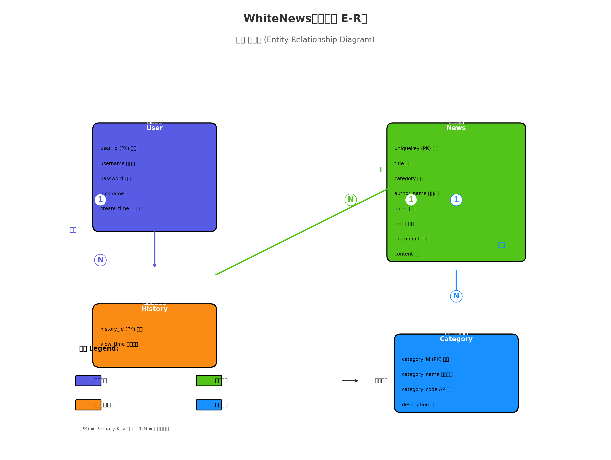

# WhiteNews 新闻应用 - 数据库设计文档

| 文档版本 | 1.0 |
|---------|------|
| 创建日期 | 2026-05-13 |
| 项目名称 | WhiteNews |
| 设计工具 | SQLite |

---

## 一、数据库概述

### 1.1 设计目标

根据WhiteNews新闻应用的功能需求，设计满足以下要求的数据库：
- 支持用户注册、登录、个人信息管理
- 支持新闻分类浏览和详情查看
- 支持用户浏览历史记录管理
- 保证数据完整性和安全性

### 1.2 E-R图



---

## 二、实体设计

### 2.1 用户实体 (User)

| 属性名 | 数据类型 | 约束 | 说明 |
|--------|---------|------|------|
| user_id | INTEGER | PRIMARY KEY AUTOINCREMENT | 用户ID，自增主键 |
| username | TEXT | NOT NULL UNIQUE | 用户名，唯一约束 |
| password | TEXT | NOT NULL | 密码 |
| nickname | TEXT | DEFAULT '这个家伙很懒，什么都没留下~~' | 昵称 |
| create_time | TEXT | DEFAULT CURRENT_TIMESTAMP | 创建时间 |

### 2.2 新闻实体 (News)

| 属性名 | 数据类型 | 约束 | 说明 |
|--------|---------|------|------|
| uniquekey | TEXT | PRIMARY KEY | 新闻唯一标识 |
| title | TEXT | NOT NULL | 新闻标题 |
| category | TEXT | NOT NULL | 新闻分类 |
| author_name | TEXT | | 作者/来源 |
| date | TEXT | | 发布日期 |
| url | TEXT | | 原文链接 |
| thumbnail_pic_s | TEXT | | 缩略图1 |
| thumbnail_pic_s02 | TEXT | | 缩略图2 |
| thumbnail_pic_s03 | TEXT | | 缩略图3 |
| content | TEXT | | 新闻正文 |

### 2.3 历史记录实体 (History)

| 属性名 | 数据类型 | 约束 | 说明 |
|--------|---------|------|------|
| history_id | INTEGER | PRIMARY KEY AUTOINCREMENT | 历史记录ID |
| username | TEXT | NOT NULL | 用户名（外键） |
| uniquekey | TEXT | NOT NULL | 新闻唯一标识（外键） |
| news_title | TEXT | | 新闻标题 |
| news_url | TEXT | | 新闻链接 |
| news_thumbnail | TEXT | | 缩略图 |
| new_json | TEXT | | 新闻完整JSON数据 |
| view_time | TEXT | DEFAULT CURRENT_TIMESTAMP | 浏览时间 |

### 2.4 新闻分类实体 (Category)

| 属性名 | 数据类型 | 约束 | 说明 |
|--------|---------|------|------|
| category_id | INTEGER | PRIMARY KEY AUTOINCREMENT | 分类ID |
| category_name | TEXT | NOT NULL | 分类名称 |
| category_code | TEXT | NOT NULL | API参数 |
| description | TEXT | | 分类描述 |

---

## 三、关系设计

### 3.1 实体关系图

```
┌─────────┐         ┌─────────────┐         ┌─────────┐
│  用户   │────────→│  历史记录   │←────────│  新闻   │
│ (User)  │   1:N   │ (History)  │   N:1   │ (News)  │
└─────────┘         └─────────────┘         └─────────┘
                                                 ↑
                                                 │ N:1
                                                 │
                                          ┌─────────────┐
                                          │   分类      │
                                          │ (Category)  │
                                          └─────────────┘
```

### 3.2 关系说明

| 关系 | 左实体 | 右实体 | 关系类型 | 说明 |
|------|--------|--------|---------|------|
| 浏览 | 用户 | 历史记录 | 1:N | 一个用户可以浏览多条新闻，产生多条历史记录 |
| 记录 | 历史记录 | 新闻 | N:1 | 一条历史记录对应一条新闻 |
| 属于 | 新闻 | 分类 | N:1 | 多条新闻属于同一分类 |

---

## 四、数据库表结构

### 4.1 用户表 (user_table)

```sql
CREATE TABLE user_table (
    user_id INTEGER PRIMARY KEY AUTOINCREMENT,
    username TEXT NOT NULL UNIQUE,
    password TEXT NOT NULL,
    nickname TEXT DEFAULT '这个家伙很懒，什么都没留下~~',
    create_time TEXT DEFAULT CURRENT_TIMESTAMP
);
```

**索引：**
- username (唯一索引)

### 4.2 历史记录表 (history_table)

```sql
CREATE TABLE history_table (
    history_id INTEGER PRIMARY KEY AUTOINCREMENT,
    username TEXT NOT NULL,
    uniquekey TEXT NOT NULL,
    news_title TEXT,
    news_url TEXT,
    news_thumbnail TEXT,
    new_json TEXT,
    view_time TEXT DEFAULT CURRENT_TIMESTAMP,
    UNIQUE(username, uniquekey)
);
```

**索引：**
- username (普通索引)
- uniquekey (普通索引)
- username + uniquekey (唯一复合索引，防止重复记录)

### 4.3 新闻表 (news_table)

```sql
CREATE TABLE news_table (
    uniquekey TEXT PRIMARY KEY,
    title TEXT NOT NULL,
    category TEXT NOT NULL,
    author_name TEXT,
    date TEXT,
    url TEXT,
    thumbnail_pic_s TEXT,
    thumbnail_pic_s02 TEXT,
    thumbnail_pic_s03 TEXT,
    content TEXT
);
```

**说明：**
- 新闻数据主要从API获取，本地主要用于缓存
- uniquekey作为主键，避免重复存储

### 4.4 分类表 (category_table)

```sql
CREATE TABLE category_table (
    category_id INTEGER PRIMARY KEY AUTOINCREMENT,
    category_name TEXT NOT NULL,
    category_code TEXT NOT NULL UNIQUE,
    description TEXT
);
```

**预置数据：**

| category_name | category_code | description |
|--------------|---------------|-------------|
| 推荐 | top | 头条新闻 |
| 国内 | guonei | 国内新闻 |
| 国际 | guoji | 国际新闻 |
| 娱乐 | yule | 娱乐新闻 |
| 体育 | tiyu | 体育新闻 |
| 军事 | junshi | 军事新闻 |
| 科技 | keji | 科技新闻 |
| 财经 | caijing | 财经新闻 |
| 游戏 | youxi | 游戏新闻 |
| 汽车 | qiche | 汽车新闻 |
| 健康 | jiangkang | 健康新闻 |

---

## 五、数据完整性设计

### 5.1 约束规则

| 约束类型 | 约束对象 | 约束内容 |
|---------|---------|---------|
| 主键约束 | user_id, uniquekey, history_id | 唯一且非空 |
| 唯一约束 | username | 用户名唯一 |
| 外键约束 | username (历史记录) | 引用用户表 |
| 外键约束 | uniquekey (历史记录) | 引用新闻表 |
| 非空约束 | password, title, category | 核心字段非空 |

### 5.2 触发器设计

**自动记录浏览时间更新：**
```sql
-- 历史记录时间更新触发器（如需要）
CREATE TRIGGER update_view_time 
AFTER UPDATE OF view_time ON history_table
BEGIN
    UPDATE history_table 
    SET view_time = CURRENT_TIMESTAMP 
    WHERE history_id = NEW.history_id;
END;
```

---

## 六、安全设计

### 6.1 密码安全

| 安全措施 | 说明 |
|---------|------|
| 密码验证 | 6-20位字符长度验证 |
| 密码存储 | 明文存储（实际项目中应加密） |

### 6.2 数据隔离

| 隔离级别 | 实现方式 |
|---------|---------|
| 用户级隔离 | 历史记录按username字段隔离 |
| 会话管理 | SharedPreferences存储登录状态 |

---

## 七、性能设计

### 7.1 索引优化

| 表名 | 索引类型 | 索引字段 | 优化目的 |
|------|---------|---------|---------|
| user_table | UNIQUE | username | 快速查找用户 |
| history_table | INDEX | username | 快速查询用户历史 |
| history_table | UNIQUE | username, uniquekey | 防止重复浏览 |

### 7.2 查询优化

| 查询场景 | 优化策略 |
|---------|---------|
| 按用户查历史 | 使用username索引 |
| 历史去重 | 使用唯一复合索引 |
| 新闻分类浏览 | 按category字段分组 |

---

## 八、数据库版本管理

| 版本 | 日期 | 修改内容 |
|------|------|---------|
| 1.0 | 2026-05-13 | 初始版本，包含用户、历史、新闻、分类四张表 |

---

## 九、附录

### 9.1 E-R图说明


**图例：**
- 蓝色方框：用户实体
- 绿色方框：新闻实体
- 橙色方框：历史记录实体
- 浅蓝方框：分类实体
- 箭头连线：实体间关系
- 1/N：表示一对多关系

### 9.2 相关文档

| 文档名称 | 说明 |
|---------|------|
| [需求分析文档.md](需求分析文档.md) | 项目需求分析 |
| [功能测试及接口测试报告.md](功能测试及接口测试报告.md) | 测试报告 |
